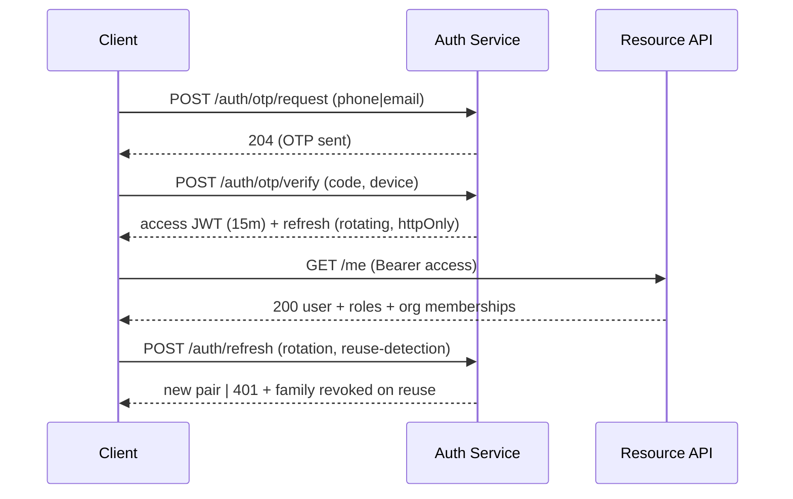

# GFE — API Specification

**Public contract:** REST v1 (OpenAPI 3.1 —
[`platform/apps/api/openapi.yaml`](../../platform/apps/api/openapi.yaml)).
**Product BFF:** GraphQL (internal only). **Base URL:**
`https://api.gfe.football/v1`.

## 1. Conventions

- JSON:API-lite envelope: `{ data, meta, errors[] }`; RFC 9457 problem
  details for errors.
- Cursor pagination (`?cursor=&limit=`; max 100). Sparse fieldsets via
  `?fields=`.
- **Idempotency:** all POSTs accept `Idempotency-Key`; 24h dedupe window.
- **Versioning:** URI major (`/v1`); additive changes only within a major;
  deprecation via `Sunset` header + 12-month partner window.
- **Rate limits:** per access token + IP; route classes: `read` 600/min,
  `write` 120/min, `auth` 10/min, `upload` 30/min. 429 with `Retry-After`.
- Money in minor units + ISO-4217; time in RFC 3339 UTC; ids are ULIDs.

## 2. Authentication & authorisation flows

- **Step-up auth:** mandate signing, consent grants, payout changes require
  recent-auth (≤5 min) or WebAuthn assertion.
- **Guardian co-sign:** minor-affecting actions create a `pending_consent`
  resource; guardian approves via their own authenticated session — two
  distinct principals recorded on the consent artefact.
- **Tokens:** access JWT (aud, role claims, org claims, `ver` for instant
  revocation via version bump); refresh in httpOnly SameSite=strict cookie
  (web) / secure storage (mobile).
- **Partner API:** OAuth2 client-credentials + mTLS optional; scoped API
  keys for read-only integrations.
- **Webhooks:** HMAC-SHA256 signature header (`GFE-Signature: t=…,v1=…`),
  5-attempt exponential retry, per-endpoint secret rotation, event
  allow-list per subscription.

## 3. Resource map (v1 endpoints)

### Identity
| Method & path | Purpose | Access |
|---|---|---|
| POST `/auth/otp/request` · `/auth/otp/verify` · `/auth/refresh` · `/auth/logout` | auth lifecycle | public/authed |
| GET/PATCH `/me` | own account | authed |
| POST `/orgs` · GET `/orgs/{id}` · PATCH | organisations | KYB-gated |
| POST `/orgs/{id}/members` · DELETE | membership | org admin |
| POST `/guardianships` · POST `/guardianships/{id}/accept` | guardian links | guardian+minor |

### Talent
| Method & path | Purpose |
|---|---|
| GET `/players/{id}` · PATCH `/players/{id}` | profile (field-level privacy applied) |
| GET `/players/{id}/cv` · POST `/players/{id}/cv/share-links` · DELETE `…/{token}` | CV + shares |
| GET `/players/{id}/cv.pdf` | PDF export (signed URL) |
| POST `/players/{id}/career-entries` · PATCH · DELETE | timeline |
| POST `/players/{id}/stats` | stat submission (provenance from caller role) |
| POST `/media/uploads` (tus create) → PATCH chunks → POST `/media/{id}/tags` | video pipeline |
| POST `/media/{id}/verify` | authorised confirmation |
| POST `/players/{id}/scouting-reports` · GET | reports (approved scouts) |

### Marketplace
| Method & path | Purpose |
|---|---|
| GET `/opportunities` (facets: kind, position, ageBand, region, level) | board |
| POST `/opportunities` · PATCH `…/{id}` · POST `…/{id}/close` | demand side |
| POST `/opportunities/{id}/applications` | apply (guardian-consent gate for minors) |
| PATCH `/applications/{id}` (shortlist/invite/outcome) | pipeline |

### Representation
| Method & path | Purpose |
|---|---|
| POST `/mandates` (draft) · POST `/mandates/{id}/request-consent` | agent side |
| POST `/consents/{id}/approve` | player (+guardian) signature, step-up |
| GET `/mandates/registry?player=` | public registry projection |
| POST `/deal-rooms` · members/docs/notes/milestones subresources | deals (P2) |

### Trust
| Method & path | Purpose |
|---|---|
| POST `/verification-cases` · POST `…/{id}/evidence` | request badges |
| GET `/verify/anchor?type=&id=&hash=` | **public** anchor proof check |
| GET `/audit/records/{type}/{id}` | party-scoped audit trail |

### Comms, search, admin
| Method & path | Purpose |
|---|---|
| POST `/threads` · GET `/threads` · POST `/threads/{id}/messages` | messaging (role-gate matrix; minor rules) |
| GET `/search?q=&type=` | permission-filtered federated search |
| `/admin/**` | queues, decisions, flags — admin RBAC + IP allowlist |

## 4. GraphQL BFF (internal)

Single graph over the same application services (no direct DB): screen-
shaped queries (`opportunityBoard`, `playerDossier`, `dealRoomView`),
persisted queries only in production, cost-limits + depth-limits, and the
same authz decisions re-checked at resolver level.

## 5. Error model & status usage

`400` validation (zod issue list) · `401` unauthenticated · `403`
authorisation or **compliance gate** (subcode `MINOR_CONSENT_REQUIRED`,
`KYC_REQUIRED`, `LICENCE_UNVERIFIED`) · `409` state-machine violations ·
`422` domain rule (e.g. exclusive mandate overlap) · `429` rate ·
`5xx` with incident id. Every error carries `traceId`.

## 6. Public API productisation (P2)

Read-only data products (verified profile embeds, mandate registry checks,
anchor verification) exposed via API keys with per-plan quotas — the
"Stripe-for-football" surface partners integrate against.
