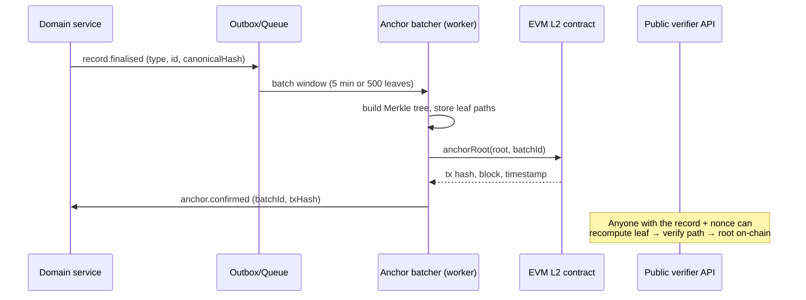

# GFE — Blockchain & Smart Contract Architecture

**Principle #1: no personal data on-chain. Ever.** The chain proves that a
record existed at a time and has not been secretly changed. It never stores
the record.

## 1. What goes where

| Layer | Contents |
|---|---|
| **On-chain** | Merkle roots of record-hash batches; mandate/consent/deal-milestone *event fingerprints* (hash + type code + timestamp); contract addresses & registry pointers. Nothing else. |
| **Off-chain (Postgres + object storage)** | All records, documents, PII, media — encrypted, access-controlled, erasable. |
| **Hashed** | Canonical JSON of each anchorable record (stable key order, normalised timestamps) → SHA-256 → Merkle leaf. Salted with a per-record random nonce stored off-chain, so hashes can't be dictionary-tested against guessed record contents. |

## 2. How anchoring works



- **Cost:** one L2 transaction per batch (~$0.001–0.01) regardless of batch
  size → anchoring is effectively free at any scale.
- **Chain choice:** EVM L2 (Base or Polygon PoS) via a `ChainPort` adapter;
  proofs remain valid independently of provider because the root + tx are
  public.
- **Verification:** `GET /verify/anchor` recomputes and checks inclusion;
  also usable fully offline with the published contract address.

## 3. Identity on-chain?

No. Identity = KYC'd off-chain accounts. On-chain there are **no user
addresses** in MVP; GFE's anchor service is the only signer. In Phase 3 we
may issue **soulbound attestations** (badge type + subject *commitment
hash*, not identity) so third parties can check "this credential hash was
attested by GFE" — still zero PII.

## 4. How the trust workflows use it

| Workflow | What is anchored | Why it matters |
|---|---|---|
| Mandate lifecycle | draft hash → consent artefact hash (player + guardian sigs) → activation → termination | An agent can prove priority ("my mandate existed on date X"); a family can prove what they actually signed; disputes get objective timestamps |
| Consent logs | every consent grant/withdrawal artefact | GDPR accountability + tamper-evidence |
| Deal milestones | milestone completion records in deal rooms | Commission disputes resolve on provable sequence |
| Scouting reports | report hash at submission | First-flag attribution ("I scouted her first") becomes provable |
| CV snapshots | periodic CV hash | A club can verify the CV it received is the CV that existed, unaltered |
| Audit chain | daily head of the hash-chained `AuditEvent` log | Whole audit trail becomes tamper-evident |

## 5. Smart contract design (Phase 2 surface)

Minimal, audited, boring — OpenZeppelin base, UUPS upgradeable behind a
timelocked multisig.

```solidity
// contracts/AnchorRegistry.sol (MVP)
anchorRoot(bytes32 root, uint256 batchId)   // onlyAnchorRole, emits Anchored
roots(batchId) → (root, timestamp)

// contracts/MandateRegistry.sol (P2)
registerMandate(bytes32 mandateHash, uint64 notBefore, uint64 notAfter)
consent(bytes32 mandateHash, bytes32 consentHash)   // emits Consented
terminate(bytes32 mandateHash, bytes32 reasonHash)
statusOf(mandateHash) → {Registered, Consented, Terminated}

// contracts/MilestoneEscrow.sol (P2, jurisdictions permitting)
createDeal(bytes32 dealHash, address[] parties, Milestone[])
confirmMilestone(dealId, index)      // n-of-m party confirmations
release()                            // only where stablecoin escrow is legal;
                                     // otherwise contract runs in "acknowledgement
                                     // mode" (no funds, only state + events)
```

**Dispute handling:** contracts never adjudicate. A `disputed` flag freezes
state transitions; resolution happens in GFE's off-chain dispute process
(and ultimately law); the resolution record itself is anchored. This keeps
us out of "code is law" traps while preserving evidentiary value.

## 6. Key management

Anchor signer = KMS-held key (no human access), rotated quarterly; contract
admin = 2-of-3 hardware multisig + 48h timelock; all contract events
mirrored into Postgres by an indexer worker (chain is never our only copy).

## 7. Explicit non-goals

No public token. No NFTs. No user-held wallets in MVP. No PII, no salaries,
no medical data, no minors' identifiers on-chain — ever. Erasure requests
are satisfiable because on-chain data is only salted hashes.
