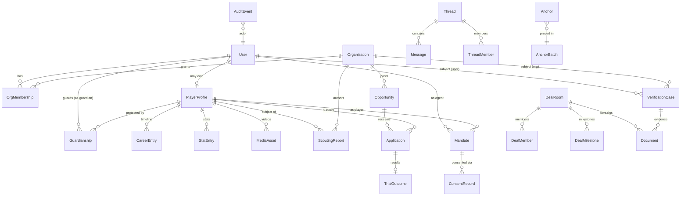

# GFE — Database Design & ERD

**System of record:** PostgreSQL 16. **Schema-as-code:**
[`platform/packages/db/prisma/schema.prisma`](../../platform/packages/db/prisma/schema.prisma)
is the executable, authoritative schema (deliverable #24). This document
explains the model, relationships, indexing and audit strategy.

## 1. Modelling principles

1. **Provenance is a column, not a comment.** Stats, career entries and
   media carry `provenance` (SELF / ACADEMY / CLUB / VERIFIED_PARTNER) and
   `verifiedById`.
2. **Minors are structurally different.** `Guardianship` links are enforced
   by constraints; publishing paths check them in SQL, not just app code.
3. **Nothing sensitive is ever hard-deleted.** Soft delete + `AuditEvent`
   append-only trail; GDPR erasure via crypto-shredding of per-subject keys.
4. **Every trust-relevant artefact is anchorable.** `Anchor` rows reference
   any record via `(recordType, recordId, sha256)`.
5. **RLS on every tenant-scoped table** (org id column + policy) beneath
   application authz.

## 2. ERD — core entities

## 3. Entity groups (≈40 tables)

### Identity & access
| Table | Purpose | Notable columns / constraints |
|---|---|---|
| `User` | person account | `role`, `status`, `dobEncrypted`, `isMinor` (generated), phone/email unique, `kycStatus` |
| `Organisation` | academy/club/agency/sponsor/investor/media | `type`, `kybStatus`, `country`, `verifiedBadge` |
| `OrgMembership` | user↔org with org role | unique(userId, orgId); role enum OWNER/ADMIN/STAFF |
| `Guardianship` | guardian↔minor link | status enum; ≥1 ACTIVE required before minor publishes (enforced by trigger) |
| `Session` / `AuthCredential` | sessions, OTP, WebAuthn creds | rotating refresh tokens, device binding |
| `ApiKey` | partner access | hashed, scoped, rate class |

### Talent
| Table | Purpose | Notes |
|---|---|---|
| `PlayerProfile` | the football identity | positions[], dominantFoot, height/weight, availability, `visibility` JSONB per-field |
| `CareerEntry` | timeline items | orgId nullable + freetext club for unverified history; `provenance` |
| `Competition`, `Match` | reference fixtures | matches optionally club-confirmed |
| `StatEntry` | per (player, match) metrics | `provenance`, `supersededById` self-FK; partial unique index on live rows |
| `MediaAsset` | videos/images | state machine `UPLOADING→PROCESSING→READY`, `verificationStatus`, tags[] (action enum), HLS manifest key |
| `Reference` / `Endorsement` (P2) | testimonials | author FK, visibility |

### Marketplace
| Table | Purpose | Notes |
|---|---|---|
| `Opportunity` | club request / trial / sponsorship / investment / media | `kind` enum, structured criteria JSONB validated by zod schema version, `expiresAt`, status |
| `Application` | player/org applies | state machine SUBMITTED→SHORTLISTED→INVITED→COMPLETED/REJECTED; guardian-consent FK required when applicant is minor (CHECK) |
| `TrialOutcome` | result record | education-guarantee acknowledgement for minors |

### Representation & deals
| Table | Purpose | Notes |
|---|---|---|
| `Mandate` | representation contract | duration, territory[], exclusive, commissionBps, licenceRef, state machine; unique active-exclusive per (player, territory) partial index |
| `DealRoom` | secure workspace | linked opportunity/mandate; `complianceChecklist` JSONB |
| `DealMember`, `DealMilestone`, `DealNote` | membership, milestones, notes | milestone events anchorable |
| `Document` | files (contracts, IDs, NDAs) | storage key, sha256, `piiClass`, per-org KMS key id, watermark flag |

### Trust & compliance
| Table | Purpose | Notes |
|---|---|---|
| `VerificationCase` | badge workflow | subject polymorphic (userId XOR orgId XOR recordRef), evidence docs, reviewer, decision, `expiresAt` |
| `ConsentRecord` | consent artefacts | purpose enum, policyVersion, signature payload hash, guardian co-sign FK |
| `AuditEvent` | append-only audit | `actor`, `action`, `recordType/Id`, `before/after` hashes, chained `prevHash` for tamper evidence |
| `Anchor` | record hash registered for anchoring | (recordType, recordId, sha256, batchId, merklePath) |
| `AnchorBatch` | merkle root + chain tx | txHash, blockNumber, confirmedAt |
| `FraudSignal` | detector outputs | type, score, features JSONB, reviewState |

### Communications
| Table | Purpose | Notes |
|---|---|---|
| `Thread`, `ThreadMember`, `Message` | messaging | thread `kind` (DIRECT, ORG, GUARDIAN_APPROACH); minor rules enforced in SQL policy + service; retention class |
| `Notification` | dispatch log | channel, template, status |

### Platform
`FeatureFlagOverride`, `WebhookEndpoint`, `WebhookDelivery`, `IdempotencyKey`,
`SearchOutbox` (event outbox), `RateLimitBucket` (if not Redis-only).

## 4. Indexing strategy (hot paths)

| Query | Index |
|---|---|
| Opportunity board by role/criteria | `Opportunity(status, kind, expiresAt)` + GIN on criteria JSONB paths (position, ageBand, region) |
| Player search facets | handled in search engine; DB backstop: `PlayerProfile(country, positions)` GIN |
| Mandate registry lookups | `Mandate(playerId, status)`, partial unique `WHERE status='ACTIVE' AND exclusive` |
| Messaging | `Message(threadId, createdAt DESC)` covering; `ThreadMember(userId, lastReadAt)` |
| Stats display | `StatEntry(playerId, matchId) WHERE supersededById IS NULL` |
| Audit forensics | `AuditEvent(recordType, recordId, createdAt)` BRIN on createdAt |
| Anchor verification | `Anchor(recordType, recordId)` unique |

Partitioning (at ~1M users): `AuditEvent`, `Message`, `Notification`,
`WebhookDelivery` by month; `StatEntry` by hash(playerId) if needed.

## 5. Permissions model in data

- Role + relationship checks in the app (`identity` module) →
  **mirrored** by RLS policies: e.g. `Mandate` readable where
  `current_user_id IN (agentId, playerUserId, guardianOf(player))` or org
  member of party org, or admin claim.
- Field-level privacy (`PlayerProfile.visibility`) applied in serializers;
  public read models contain only public-safe projections.

## 6. Migration & data lifecycle

- Prisma Migrate; every migration reviewed for lock impact (`CONCURRENTLY`
  for index builds); expand-and-contract for renames.
- Retention: messages 24 months (configurable, legal hold override); deal &
  consent records 7 years; media until owner deletion; audit 7 years.
- GDPR erasure: per-subject envelope keys destroyed (crypto-shredding);
  anchored hashes remain (they contain no PII and prove nothing about
  content without the record).
