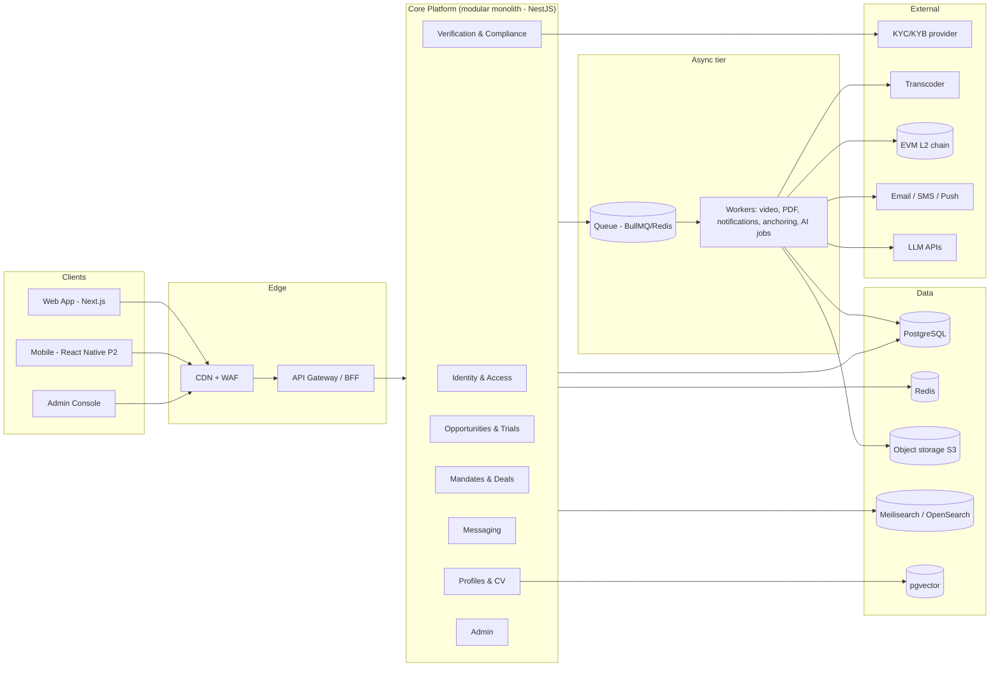
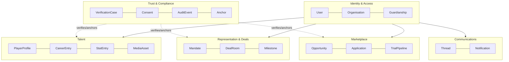

# GFE — Technical & System Architecture

**Status:** Draft v1 · **Decision style:** every choice lists rationale,
trade-offs and scaling implications.

## 1. Architecture thesis

Start as a **modular monolith** with strict domain boundaries and an event
backbone, deployed on Kubernetes, so we get microservice *option value*
without microservice *operational cost* at seed stage. Services are split
out only when a boundary shows independent scaling or team-ownership
pressure (video, AI inference and anchoring are the first candidates —
video is async from day one).

## 2. System context diagram



## 3. Tech stack (with rationale)

| Layer | Choice | Rationale | Trade-offs / scaling |
|-------|--------|-----------|----------------------|
| Language | **TypeScript everywhere** | One hiring pool, shared types end-to-end, spec requirement | CPU-heavy work (video, ML) delegated to services/managed APIs |
| Web | **Next.js 14 (App Router)** on Vercel or self-hosted | SSR for SEO of public profiles, RSC for low-bandwidth payloads, huge ecosystem | Lock-in mitigated by standard React; edge rendering optional |
| Mobile (P2) | **React Native + Expo** | Shares design system + TS models; OTA updates for emerging-market release cadence | Native video capture modules needed; budget for it |
| API | **NestJS (Fastify adapter)** modular monolith | Enforced module boundaries (DDD-friendly), DI, mature ecosystem; Fastify perf | Heavier than bare Fastify; worth it for team scale |
| API styles | **REST (public, OpenAPI)** + **GraphQL (BFF, internal)** | REST for partners/stability; GraphQL for flexible product UIs without over-fetching on 3G | Two surfaces to secure — both go through one gateway & one authz layer |
| DB | **PostgreSQL 16** (managed: RDS/Cloud SQL/Neon) | Relational integrity for deals/consents; RLS; JSONB flexibility; pgvector | Shard-by-tenant not needed until ~5–10M users; read replicas first |
| ORM | **Prisma** | Schema-as-code (deliverable #24), migrations, type-safe client | Raw SQL escape hatch for hot paths & RLS policies |
| Cache/queue | **Redis + BullMQ** | Sessions, rate limits, job queue in one operable piece | Move to Kafka/SQS when event fan-out or replay demands it (documented trigger: >50 consumers or replay needs) |
| Search | **Meilisearch** (MVP) → OpenSearch (scale) | Typo-tolerant, tiny ops burden, instant facets | Meilisearch single-node ceiling ~10M docs; swap is behind a SearchPort interface |
| Vectors | **pgvector** | No extra infra at MVP; joins with permissions | Dedicated vector DB only if >50M embeddings |
| Object storage | **S3-compatible** (S3 / R2 / MinIO dev) | Media + documents; presigned upload/download | Egress cost → CDN in front; R2 for zero-egress option |
| Video | **Upload: tus resumable → storage; Transcode: Mux or AWS MediaConvert** | Resumable is non-negotiable for 3G; managed transcode = zero video-ops at MVP | Mux per-minute cost; revisit self-hosted (ffmpeg farm) past ~50K min/month |
| Auth | **Own auth service on Lucia/Auth.js primitives + WebAuthn**; OTP via SMS/WhatsApp | Phone-first markets; sovereignty over the identity graph (it *is* the product) | More build than Auth0; Auth0 pricing hostile at 10M users anyway |
| Payments (P2) | **Stripe + Paystack/Flutterwave** | Global + African acquirer coverage | Dual integration abstracted behind PaymentsPort |
| Blockchain | **EVM L2 (Base or Polygon PoS)**, ethers.js, OpenZeppelin | Cheap anchoring (~$0.001/batch), audited primitives, talent pool | Chain choice is an adapter; records verifiable independent of chain via Merkle proofs |
| Notifications | **Novu** (or homegrown dispatcher) → email (Resend/SES), SMS/WhatsApp (Twilio/Africa's Talking), push (FCM) | Single template/preferences layer | WhatsApp template approval lead times — start early |
| Infra | **Kubernetes (EKS/GKE)** + Terraform | Spec requirement; portability across clouds incl. regional residency | K8s overhead at MVP mitigated by managed control plane + simple Helm charts |
| CI/CD | **GitHub Actions** → build, test, scan, deploy (ArgoCD or Actions-driven helm) | Repo-native; supply-chain scanning (SBOM, Trivy) | ArgoCD adopted when env count > 3 |
| Observability | **OpenTelemetry → Grafana stack (Tempo/Loki/Prometheus)** or Datadog | Vendor-neutral instrumentation from day one | Datadog $$ at scale; OTel keeps exit open |
| Feature flags | **Unleash / OpenFeature** | Kill-switches for risky features (esp. anything minor-facing) | — |
| Analytics | **PostHog (self-host option)** | Product analytics with EU/data-control story | — |

## 4. Domain-driven design — bounded contexts & service boundaries



**Context ownership rules**

- Each context = one NestJS module tree with a **public application service
  API**; no cross-context table joins in code (DB-level FKs allowed, writes
  never cross a boundary except via events).
- **Trust & Compliance** is upstream of everything: other contexts *request*
  verification and *subscribe* to outcomes; they never write trust state.
- Extraction order when scaling demands it: (1) Media pipeline (already
  async), (2) Anchoring service, (3) Search/AI read models, (4) Messaging.

## 5. Backend folder structure

```
platform/apps/api/src/
├── main.ts               # bootstrap, OTel, security middleware
├── app.module.ts
├── common/               # guards, pipes, interceptors, errors, pagination
├── config/               # typed env config, per-env
├── modules/
│   ├── identity/         # auth, users, orgs, guardianship, RBAC
│   ├── talent/           # profiles, career, stats, media metadata
│   ├── marketplace/      # opportunities, applications, trials
│   ├── representation/   # mandates, deal rooms, milestones
│   ├── trust/            # verification cases, consents, anchors, audit
│   ├── comms/            # threads, messages, notifications
│   ├── search/           # indexing consumers + query API (SearchPort)
│   └── admin/            # back-office endpoints
├── events/               # event contracts (versioned), outbox publisher
├── jobs/                 # BullMQ processors: video, pdf, anchor, ai, notify
└── ports/                # KycPort, PaymentsPort, ChainPort, TranscodePort…
```

## 6. Event-driven architecture

- **Pattern:** transactional **outbox** → Redis Streams/BullMQ (MVP) →
  Kafka when needed. Every domain mutation that other contexts care about
  emits a versioned event (`talent.stat.verified.v1`).
- **Consumers:** search indexer, notification dispatcher, anchor batcher,
  AI feature builder, analytics forwarder, audit projector.
- **Guarantees:** at-least-once with idempotent consumers (event UUID
  dedupe table). Ordering per aggregate via stream key.
- **Catalogue (excerpt):**

| Event | Producer | Key consumers |
|---|---|---|
| identity.user.verified.v1 | Trust | Talent, Comms, Search |
| talent.media.transcoded.v1 | Jobs | Talent, Search |
| talent.stat.superseded.v1 | Talent | Search, Audit |
| market.trial.invited.v1 | Marketplace | Comms, Compliance |
| rep.mandate.consented.v1 | Representation | Trust(anchor), Registry, Comms |
| trust.badge.granted.v1 | Trust | All read models |
| trust.anchor.confirmed.v1 | Jobs | Trust, public verifier |

## 7. API gateway & BFF

Single ingress: authn (JWT access + rotating refresh), rate limiting
(sliding window per user+IP+route class), request signing for partner API,
schema validation, idempotency keys on all POSTs, response caching for
public profiles. GraphQL BFF is internal-only; REST is the public contract.

## 8. Data access & multi-tenancy

- Single database, tenant = organisation; **Postgres RLS** enforces org
  scoping as defence-in-depth beneath application authz.
- PII columns encrypted at application layer (envelope encryption, KMS
  keys); documents stored encrypted in object storage with per-org keys.
- Read models for hot screens (opportunity board, search) are denormalised
  projections maintained by event consumers — never queried off the write
  model at scale.

## 9. Scalability plan (summary — full plan in infrastructure.md §10)

| Stage | Users | Moves |
|-------|-------|-------|
| Seed | 1K–10K | Single region (eu-west/af-south), 2× API pods, managed PG, Meilisearch single node |
| Growth | 100K | Read replicas, CDN-cached public profiles, worker autoscaling, OpenSearch, Kafka evaluation |
| Scale | 1M | Extract media+AI services, regional media edge, partitioned hot tables (events, messages), ArgoCD multi-env |
| Global | 10M | Multi-region active/passive → active/active reads, tenant residency pinning, dedicated data platform (CDC → lakehouse) |

## 10. Mobile app structure (Phase 2)

```
platform/apps/mobile/
├── app/                # expo-router screens mirroring web routes
├── src/features/       # same feature folders as web (profile, board, …)
├── src/components/     # RN implementations of @gfe/ui primitives
├── src/lib/            # api client (shared), offline queue, upload manager
└── src/services/       # push, deep links, camera/video capture
```

Offline-first: local queue for profile edits & uploads, background sync,
delta pulls. Video capture with on-device compression before upload.

## 11. Key architecture decisions (ADR index)

| ADR | Decision | Status |
|-----|----------|--------|
| 001 | Modular monolith first, event backbone from day one | Accepted |
| 002 | TypeScript across stack | Accepted |
| 003 | Postgres as system of record; RLS defence-in-depth | Accepted |
| 004 | Hash-anchoring on EVM L2; no PII on-chain ever | Accepted |
| 005 | Own auth (phone-first OTP + WebAuthn) | Accepted |
| 006 | Managed transcode (Mux) until 50K min/month | Accepted |
| 007 | Meilisearch → OpenSearch behind SearchPort | Accepted |
| 008 | REST public + GraphQL BFF | Accepted |
| 009 | Africa-first region: af-south-1 primary, eu-west-1 DR | Proposed |
