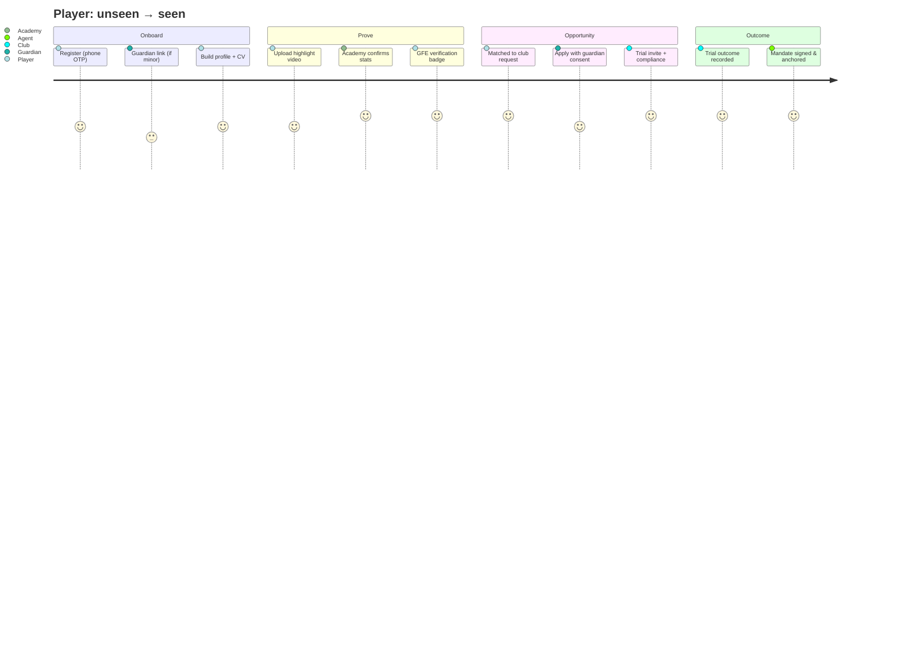

# GFE — UX: Journeys, Wireframes & Page Specifications

Format per page: **Purpose · Key components · Journey · State management ·
Responsive · Accessibility.** Wireframes are ASCII (desktop-first sketch;
mobile behaviour noted).

## 1. Primary user journeys



Other mapped journeys (same rigour, kept terse):

- **Club:** post request → AI-ranked candidates → dossier review →
  shortlist → trial invites (compliance auto-gated) → outcomes → history
  feeds reputation.
- **Agent:** verify licence → build portfolio → draft mandate →
  player+guardian consent ceremony → registry entry → respond to club
  requests → deal room (P2).
- **Academy:** KYB → roster import → confirm player stats/videos →
  showcase alumni → receive partnership/sponsorship interest.
- **Guardian:** invitation → KYC → review pending consents → approve/deny
  with full context → monitor approaches log.
- **Admin:** verification queue → evidence review → decision + badge →
  fraud flags triage → safety escalations.

## 2. Landing page

- **Purpose:** convert three audiences (talent, clubs/scouts, academies)
  and radiate trust.
- **Components:** hero (black, gold headline, one CTA), trust strip
  (verification stats), role tiles, product tour, safeguarding statement,
  investor/press footer.
- **Journey:** role tile → role-specific signup.
- **State:** static + `GET /stats/public`; no auth.
- **Responsive:** single column < 900px; hero type scales via clamp.
- **A11y:** landmark structure, skip-nav, contrast-checked gold usage.

## 3. Onboarding & auth

```
┌──────────────────────────────────────────────┐
│  GFE ◆                                        │
│  Who are you in football?                     │
│  ┌────────┐ ┌────────┐ ┌────────┐ ┌───────┐  │
│  │ Player │ │Academy │ │  Club  │ │ Agent │…│
│  └────────┘ └────────┘ └────────┘ └───────┘  │
│  → phone → OTP → role details → (minor?      │
│    guardian invite) → profile checklist      │
└──────────────────────────────────────────────┘
```
- **State:** onboarding machine (XState) persisted server-side; resumable.
- **Minor branch:** DOB → guardian invite (SMS/WhatsApp) → account limited
  ("private mode") until guardianship ACTIVE.
- **A11y:** OTP autocomplete (`one-time-code`), error text tied to inputs.

## 4. Player profile & CV

```
┌───────────────────────────────────────────────────────────┐
│ ◇ Amara D.  ✓ GFE-Verified   [Availability: Open]  [Share]│
│ FW · 16 (U17) · SEN · R-foot · 1.78m   Étoile de Dakar    │
├───────────────┬───────────────────────────────────────────┤
│ CV sections   │  Stats (Provenance: CLUB ✓)               │
│ • Timeline    │  ┌─────┬─────┬─────┬─────┐                │
│ • Stats       │  │ 31M │ 19G │ 8A  │ 96p │ …tiles         │
│ • Videos      │  └─────┴─────┴─────┴─────┘                │
│ • Reports     │  Videos ▸ [▶ verified] [▶ pending] …      │
│ • References  │  Scouting reports (2 · gated)             │
│ [Export PDF]  │  Representation: mandate ✓ (registry)     │
└───────────────┴───────────────────────────────────────────┘
```
- **Purpose:** the dossier a sporting director trusts in 90 seconds.
- **State:** RSC-rendered dossier query; owner edit-in-place (optimistic,
  autosave); visibility controls per section.
- **Responsive:** sidebar → sticky tab bar on mobile; stat tiles 2-col.
- **A11y:** all media captioned/labelled; provenance tags have text, not
  colour-only.

## 5. Opportunity board & application

- **Purpose:** liquid marketplace of structured demand.
- **Components:** FacetFilterBar (kind/position/age/region/level),
  OpportunityCard list (virtualised), "For you" AI rail with match
  explanations, ApplicationStepper.
- **Journey:** filter → detail → apply → (minor: guardian consent
  interstitial — application parked as `awaiting_consent`) → tracking.
- **State:** URL-driven filters (shareable), cursor infinite scroll,
  application state machine mirrored from server.

## 6. Mandate consent ceremony (trust-critical screen)

```
┌────────────────────────────────────────────┐
│ Mandate: XYZ Sports ↔ Amara D.             │
│ Term 24m · Territory: EU+UK · Excl: Yes    │
│ Commission: 5% · Licence: FIFA #12345 ✓    │
│ ────────────────────────────────────────── │
│ ① Agent signed        ✓ 12 Mar 14:02       │
│ ② Player review       [Read full terms]    │
│ ③ Guardian approval   ⏳ awaiting           │
│ [Decline]                [Sign — step-up]  │
│ ⚓ Will be anchored: SHA-256 fingerprint    │
└────────────────────────────────────────────┘
```
- Step-up auth on sign; plain-language term summary above legal text;
  post-signature screen shows anchor status and verification link.

## 7. Admin console (deliverable #26)

- **Queues:** Verification (badge cases w/ evidence viewer, SLA timers),
  Fraud flags (signal detail, linked accounts graph), Safety (minor
  escalations — highest priority routing), Disputes (mandates/deals).
- **Entity ops:** user/org search, lifecycle actions (restrict/suspend)
  with mandatory reason → audit; document viewer (watermarked, no
  download by default); licence-import manager.
- **Analytics:** funnel (signup→verified→opportunity→trial), marketplace
  liquidity, safety SLA dashboards, verification throughput.
- **Controls:** feature flags, rate-limit overrides, webhook monitor,
  anchoring monitor (batch lag, tx failures).
- **Access:** separate realm, hardware MFA, IP allowlist; every view of
  sensitive records is itself audited.

## 8. Messaging, search, settings (terse specs)

- **Messaging:** thread list + pane; guardian-gate notices inline;
  report/block affordances on every thread; org threads show acting-member.
- **Search (⌘K + page):** federated tabs (players/academies/clubs/
  opportunities), facets, permission-trimmed results, recent + saved
  searches.
- **Settings:** profile visibility matrix, guardian management, consent
  ledger (with withdraw buttons), sessions/devices, data export (DSAR),
  danger zone.

## 9. State management conventions (web)

Server state: TanStack Query + RSC prefetch; forms: react-hook-form + zod
(same schemas as API); flows: XState machines for onboarding, application,
consent ceremony; optimistic updates only where server can't reject on
business rules; global client state kept to session/theme/feature flags
(Zustand). Error surfaces: inline field → toast → page-level boundary with
traceId.
