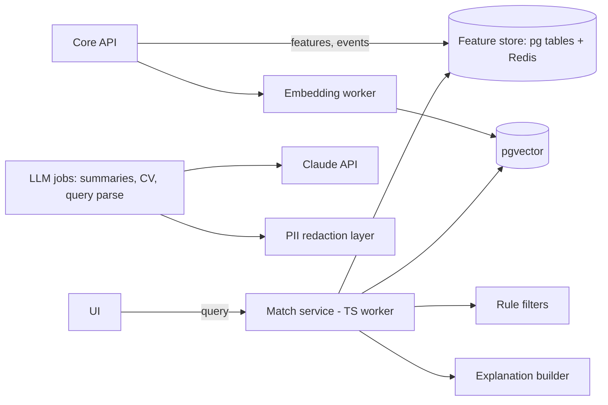

# GFE — AI Architecture

**Stance:** AI ranks, summarises and flags; **humans decide**. Every AI
output carries provenance, an explanation, and an edit-before-publish step
where it touches a human's reputation. No fully automated adverse decisions
(GDPR Art. 22-aligned). Minors: no behavioural profiling; matching uses
football data only.

## 1. Capability map

| Capability | Phase | Approach |
|---|---|---|
| Semantic search ("left-footed U17 CB, high aerial win %, West Africa") | MVP | Query parsing (LLM → structured filters) + hybrid retrieval: Meilisearch keyword ∪ pgvector similarity → re-rank |
| Player ↔ opportunity matching | MVP | Two-tower embeddings (player features / opportunity criteria) + hard rule filters (age band, position, availability, region) + gradient-boosted re-ranker on interaction outcomes |
| "Why matched" explanations | MVP | Template over feature contributions — always shown |
| Scouting report summaries | MVP-lite | LLM condenses structured report + stats into club-facing brief; author approves before publish |
| CV generation / profile optimisation | MVP-lite | LLM drafts summary + improvement checklist from profile completeness heuristics; player approves |
| Sponsor / investor matching | P2 | Same matching core, different feature spaces (audience, geography, budget bands) |
| Risk & fraud detection | MVP rules → P2 ML | Rules engine (licence mismatch, doc reuse via perceptual hash, velocity, template-photo detection) → anomaly models once labelled data accrues |
| Grooming-pattern detection in messaging | MVP rules → P2 classifier | Keyword/pattern rules + contact-graph heuristics → escalation to safety queue (human review only, never auto-action on speech) |
| Deal intelligence (comparables, milestone risk) | P3 | Retrieval over anonymised closed-deal corpus |
| Video auto-tagging (action detection) | P3 | Start with human tags as training data; evaluate vendor models vs fine-tuned ViT/TimeSformer |

## 2. Serving architecture

- **LLM access** via a single gateway worker: prompt templates versioned in
  repo, PII redaction before external calls, response validation (zod),
  token budgets per feature, full request/response logging (minus PII) for
  eval.
- **Embeddings:** football-feature vectors (position one-hots, percentile
  stats, style tags) concatenated with text embeddings of bios/reports;
  refreshed on profile events via outbox consumers.
- **Cold start:** rules + popularity priors; interaction data (views,
  shortlists, invites, outcomes) trains the re-ranker from month 2.

## 3. Quality, safety, governance

- Offline eval sets per capability (golden queries, labelled matches);
  regression gates in CI for prompt/model changes.
- Online: interleaving experiments on ranking; human-rating queues for
  summaries; hallucination guard = summaries may only reference fields
  present in the source record (validator enforces).
- Fairness: matching audited for nationality/region skew quarterly;
  explanations make criteria visible so bias is contestable.
- Model registry doc per model: purpose, data, evals, owner, rollback.

## 4. Build vs buy

Buy (API): LLM (Claude), OCR/doc AI (KYC vendor), transcription. Build:
matching/ranking (core IP), fraud rules, feature store, explanations.
Defer: video action recognition (expensive; human tags first, models later
when we own labelled data at scale — that dataset itself becomes a moat).
