# GFE — Infrastructure, Delivery & Operations

## 1. Cloud & regions

- **Primary:** AWS `af-south-1` (Cape Town) — latency to core markets +
  data-locality story. **DR/secondary:** `eu-west-1`.
- Rationale: managed Postgres/K8s/KMS maturity + African region presence.
  Trade-off: some managed services thinner in af-south-1 (fallback: run in
  eu-west-1 with CDN edge in-continent; re-evaluate at Growth stage).
- Everything via **Terraform** (`platform/infra/terraform`): VPC (3 AZ),
  EKS, RDS Postgres (Multi-AZ), ElastiCache Redis, S3 (+ replication to DR
  bucket), CloudFront + WAF, KMS, Secrets Manager, SES; state in S3 +
  DynamoDB lock; one workspace per env (dev/staging/prod).

## 2. Environments

| Env | Purpose | Data |
|---|---|---|
| dev (local) | docker-compose: pg, redis, minio, meilisearch, mailpit, anvil (chain) | seeded fixtures |
| preview | PR-scoped web deploys + shared staging API | synthetic |
| staging | prod-parity, anonymised fixtures, chain testnet | synthetic only — **no prod PII ever** |
| prod | customer traffic | real |

## 3. Kubernetes deployment strategy

- **EKS**, managed node groups: `general` (on-demand, API), `workers`
  (spot-friendly, queues), `jobs-heavy` (burst, video/PDF).
- Workloads: `api` (HPA on CPU+p95 latency via KEDA/Prometheus adapter),
  `worker-default`, `worker-media`, `worker-anchor` (KEDA on queue depth),
  `search`, cronjobs (licence import, retention sweeps, DR drills).
- Rollouts: **Helm chart per app; blue/green for api (Argo Rollouts),
  canary 10%→50%→100% with automatic rollback on SLO burn.**
- Config: sealed via External Secrets Operator → Secrets Manager; pod
  security standards `restricted`; NetworkPolicies default-deny;
  PodDisruptionBudgets; topology spread across AZs.

## 4. CI/CD pipeline

```mermaid
flowchart LR
  PR[PR] --> L[lint+typecheck] --> T[unit+integration tests]
  T --> S[SAST+secrets+deps scan] --> B[build images + SBOM + sign]
  B --> PV[preview deploy + e2e smoke]
  PV --> M[merge to main]
  M --> STG[auto-deploy staging + full e2e + migration check]
  STG --> APPR[manual approval]
  APPR --> PRD[canary deploy prod + verify + promote]
```

- GitHub Actions (`platform-ci.yml`); merge queue; migrations applied via
  job with lock-timeout guards, backwards-compatible (expand/contract).
- Release cadence: trunk-based, deploy on green, feature flags decouple
  release from launch.

## 5. Testing & QA strategy (deliverables #29–30)

| Layer | Tooling | Gate |
|---|---|---|
| Static | TS strict, ESLint, Prettier, zod schema tests | PR |
| Unit | Vitest (domain logic ≥80% on trust/deal/consent modules) | PR |
| Integration | Testcontainers (pg, redis) against real SQL incl. **RLS policy tests** | PR |
| Contract | OpenAPI schema diff + Pact for webhook consumers | PR |
| E2E | Playwright — golden journeys (onboard incl. minor+guardian, apply, consent ceremony, verification, admin queue) | staging |
| Load | k6 — board browse, search, upload initiation at 5× forecast | pre-launch + quarterly |
| Security | Semgrep/Trivy/Checkov in CI; annual pentest; DSAR + restore drills | scheduled |
| Chaos-lite | kill-pod + AZ-loss game days | quarterly |

QA process: risk-based test plans per epic; bug triage SLAs (S1 same-day);
release checklist automated in CI where possible; exploratory testing on
low-end Android devices over throttled 3G is **mandatory** per release.

## 6. Monitoring & observability

- **OpenTelemetry** SDK everywhere → Grafana Cloud (Tempo/Loki/Mimir) or
  Datadog (decide on pricing at contract time; OTel keeps us portable).
- Golden signals per service + **SLOs:** API availability 99.9%, p95 read
  300ms; upload success ≥99%; anchor batch lag <15 min; safety-queue SLA.
  Error budgets drive release pace.
- Product analytics: PostHog; crash: Sentry (web/mobile).
- Alerting: PagerDuty; alert → runbook link mandatory; weekly SLO review.

## 7. Backups & disaster recovery (deliverable #32)

- **RPO ≤ 5 min / RTO ≤ 1 h.** RDS PITR + cross-region automated snapshots;
  S3 versioning + cross-region replication; Redis is rebuildable (no DR
  dependency); search re-indexable from Postgres (documented 4h rebuild).
- Chain data: contract events indexed to PG; anchors re-verifiable from
  public chain — chain outage degrades to "anchoring delayed", never data
  loss.
- Quarterly **restore drills** (timed, evidence kept for SOC2); runbooks:
  region failover, DB corruption point-in-time recovery, KMS key incident,
  ransomware (immutable backup copies via S3 Object Lock).

## 8. Cost estimates

**MVP (≈ months 1–6, ≤10K users):**

| Item | $/month |
|---|---|
| EKS control + 3–5 nodes | 450 |
| RDS Multi-AZ (db.r6g.large) + storage | 420 |
| Redis (cache.m6g.large) | 160 |
| S3 + CloudFront (light video) | 150 |
| Mux transcode/streaming (~3K min) | 300 |
| KYC checks (~800 @ $1.2 avg) | 960 |
| SMS/WhatsApp OTP + notifications | 250 |
| LLM APIs (search parse, summaries) | 200 |
| Observability + Sentry + PostHog | 300 |
| Chain anchoring (L2) | <10 |
| Misc (domains, email, flags) | 100 |
| **Total infra+services** | **≈ $3.3K/mo** |

**Scale (100K MAU):** ≈ $14–18K/mo infra (compute 4K, DB+replicas 2.5K,
media 4–6K depending on watch-time, KYC amortised, observability 1.5K) →
**~$0.15/MAU** target holds; video watch-time is the swing factor and is
capped by HLS bitrate policy.

## 9. Scalability plan (deliverable #34)

| Milestone | Pressure | Response |
|---|---|---|
| **1K → 10K** | none | current architecture; nightly load tests |
| **10K → 100K** | read fan-out, search | PG read replicas; CDN-cached public profiles/CVs; OpenSearch migration; worker autoscaling on queue depth |
| **100K → 1M** | events, media, hot tables | Kafka for event backbone (replay + fan-out); extract media service + regional upload edges; partition audit/messages; dedicated match/stat read models; ArgoCD multi-env |
| **1M → 10M** | multi-region, org isolation, data platform | Active/passive → active/active reads with region-pinned tenants; residency controls (NFR-10); CDC → lakehouse (Iceberg) for analytics/AI training; extract AI serving + messaging services; consider Citus/partition-by-tenant for the largest tables |

Explicit non-triggers: microservices for their own sake; GraphQL federation
before three product teams exist.
